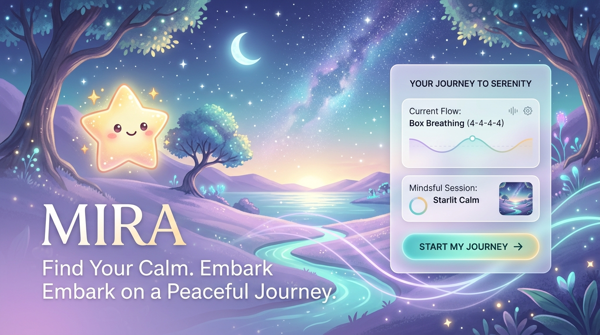
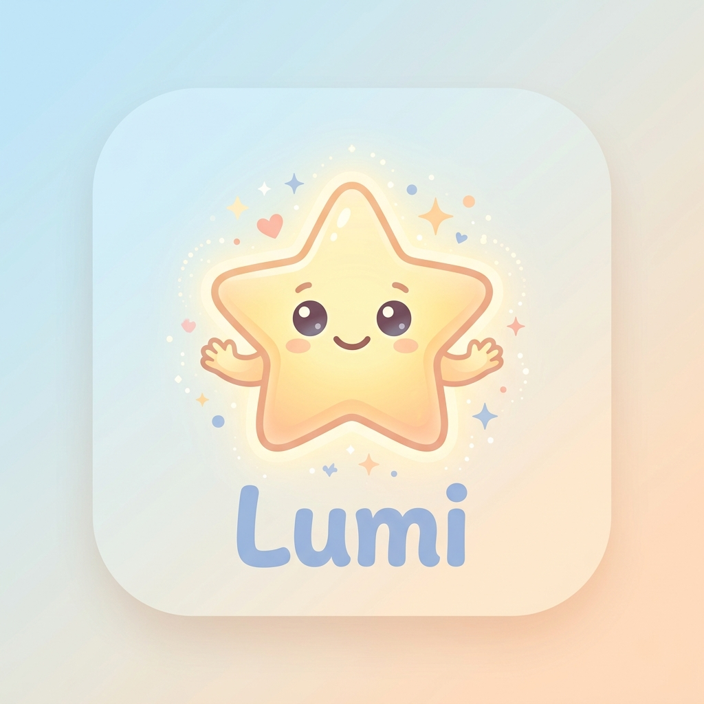

  

# MIRA 🌟
> **La Plataforma Inteligente de Crecimiento, Autonomía y Autorregulación para Familias Neurodivergentes.**

  

---

## 🕊️ La Misión: Valor Real para Familias y Necesidades Especiales

**MIRA** nace con un propósito profundo: **apoyar a niños neurodivergentes (TEA, TDAH, altas capacidades y sensibilidades sensoriales) y a sus familias** a cultivar la autorregulación emocional, la autonomía diaria y la complicidad familiar mediante un entorno digital respetuoso, no punitivo y empático.

A diferencia de las aplicaciones convencionales basadas en la presión o la sobreestimulación, **MIRA coloca la salud mental y la tranquilidad familiar en el centro**, transformando los desafíos cotidianos (rutinas, hábitos, crisis emocionales) en aventuras compartidas de aprendizaje.

---

## 💎 Pilares Neurodiversity-First (Diseño Ético y Amable)

1. **Sin Rachas Estresantes (No Streaks)**: Eliminamos los contadores de días consecutivos que generan ansiedad, frustración o sentimiento de culpa ante interrupciones.
2. **Sin Comparación Social**: Cada niño avanza a su propio ritmo. No existen tablas de clasificación, ránquines ni métricas competitivas.
3. **Sin Regresión del Compañero**: El compañero mágico (*Lumi*) evoluciona con las interacciones positivas, pero **jamás pierde su nivel alcanzado** ni muestra abandono.
4. **Baja Estimulación Sensorial Controlada**: Interfaz regulable con *Modo Calma* (inhabilitación de animaciones bruscas) y tonos armónicos de 432Hz en audio Web Audio API.
5. **Refuerzo Positivo Incremental**: No existen puntos negativos ni penalizaciones. Todas las chispas y logros son acumulativos y celebran el esfuerzo.

---

## ✨ Experiencia del Producto

### 1. Compañero Digital Mágico (*Lumi*)
Un acompañante digital adaptativo que conversa de forma empática con el niño, le lee cuentos personalizados según su estado de ánimo y desintegra los objetivos complejos en micropasos alcanzables mediante Inteligencia Artificial adaptativa.

### 2. Rincón de Calma y Autorregulación Sensorial
Un espacio seguro accesible en 1-clic con la técnica de **Respiración Guiada *Box Breathing* (4-4-4-4)**, respaldada por ondas armónicas suaves para guiar la calma en momentos de sobrecarga sensorial o desregulación emocional.

### 3. Aventuras Co-Creadas y Descomposición de Metas
Niños y padres pueden sugerir y co-crear aventuras compartidas. La aplicación utiliza IA para transformar una meta grande (*"Aprender a atar mis cordones"*) en 3 microcapítulos simples y sin presión.

### 4. Panel Parental y Terapéutico
Un centro de control completo para las familias y profesionales de la salud:
- **Exportación de Informes Terapéuticos (PDF, JSON y CSV)** con históricos de check-ins emocionales, energías y dimensiones de valor.
- **Verificación de Seguridad PIN (4 dígitos)** para proteger acciones parentales sensibles.
- **Gestión Multi-Hijo** para familias con varios pequeños.

---

## 🔒 Privacidad de Vanguardia y Procesamiento Local

- **Motor IA Local On-Device (WASM / WebLLM)**: Capaz de generar respuestas y cuentos de acompañamiento **100% offline y en el dispositivo del usuario**, sin enviar datos a servidores externos.
- **Sanitización de PII (Datos de Identificación Personal)**: Filtrado automático de nombres, direcciones y teléfonos antes de procesar cualquier interacción.
- **Portabilidad GDPR Art. 20**: Exportación completa de los datos de la familia en cualquier momento.

---

## 🏢 Propuesta de Valor para Organizaciones Terapéuticas y Clínicas

**MIRA** está concebido como una herramienta de extensión terapéutica para:
- **Centros de Atención Temprana y Terapia Ocupacional**: Seguimiento visual de la autorregulación en el hogar.
- **Psicología Infantil y Gabinetes de Psicopedagogía**: Informes emocionales semanales estructurados.
- **Asociaciones de Neurodiversidad y Familias**: Un recurso accesible desde cualquier dispositivo para mejorar la convivencia diaria.

---

## 🌟 Probar la Experiencia Interactiva (Live Product Demo)

La aplicación cuenta con una demostración interactiva completa en 1-clic que permite explorar todas sus funcionalidades sin necesidad de registro previo ni configuración:

👉 **[Explorar MIRA en Vivo (Modo Demo)](https://xaviaerox.github.io/mira-app/)**

---

  Desarrollado con amor, rigor técnico y empatía para acompañar el crecimiento de cada niño a su propio ritmo.

